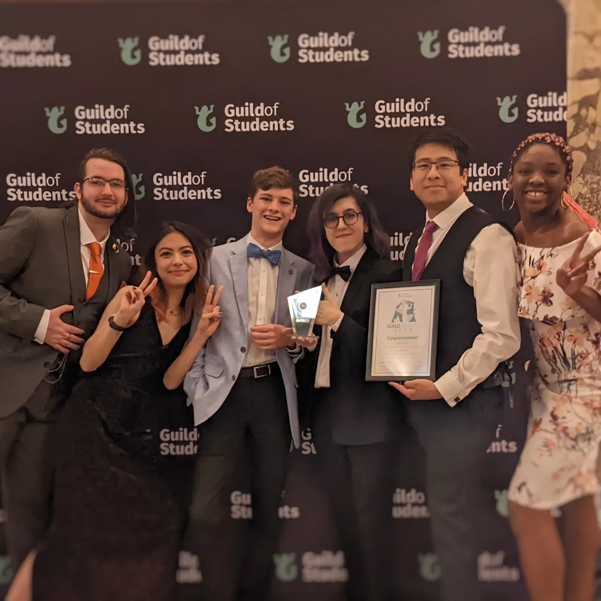

    
    <h1>Computer Science Society</h1>
    <a href="/discord" class="button discord-button"><i class="fab fa-discord"></i> Join Discord</a>
    <a href="/join" class="button guild-button"> Get Membership</a>

Hey there! 👋

We're the *award-winning* Computer Science Society **(CSS)** at the University of Birmingham.

Created and run by students for students, our goal is to provide a warm and
friendly community in which we (and you!) can socialise, develop our tech
skills and find opportunities to develop our careers! ✨ Keep an eye out for
our dinosaur mascot [TeX](/tex)!

We can't wait to see you at our events!

❤️ The CSS [Committee](/committee)

    

        
        
        
    

## Get Involved ✨

#### Join Our Discord

The best way to find out all the information you'd like to know about CSS and our
events is through our [Discord Server](/discord). 👾

We've built an amazing, friendly, virtual-community on Discord which you
can get involved with straight away — no membership required! 😃

#### Become A Member

To take part in our ticketed events, you'll want to [click here](/join) to
purchase a membership; it's only £5 for the entire year!

You can find out more about becoming a member [here](/membership).

#### Hackathons

A great way to learn new skills, make new friends and create a cool project!

We encourage everyone to take part in these really cool events.

See our page on [hackathons](/hackathons) to learn more! 

## Stay Up-To-Date &#10084;&#65039; 

In addition to joining our [Discord](/discord), if you have a Facebook account,
we recommend that you join our Facebook Group linked below! 👇

You can also find links to all of our other various social media accounts:

    <a href="/ig" class="social-link insta">
        <h4><i class="fab fa-instagram"></i> Instagram</h4>
    </a>

    <a href="/tw" class="social-link twitter">
        <h4><i class="fab fa-twitter"></i> Twitter</h4>
    </a>

    <a href="/fb" class="social-link facebook">
        <h4><i class="fab fa-facebook"></i> Facebook</h4>
    </a>

    <a href="/in" class="social-link linkedin">
        <h4><i class="fab fa-linkedin"></i> LinkedIn</h4>
    </a>

    <a href="/yt" class="social-link youtube">
        <h4><i class="fab fa-youtube"></i> YouTube</h4>
    </a>
    <a href="/gh" class="social-link github">
        <h4><i class="fab fa-github"></i> GitHub</h4>
    </a>

## Awards 🏆

Our society has won many achievements and awards, including: 

    
🏆 Outstanding Contribution to Academic Experience (2022)

    
🏆 The Great Achievement in EPS, Tom Goodman, CSS Secretary (2020)

    
🏆 Community Award, Tom Goodman, CSS President (2019)

    
🏆 Society of the Year (2017)

    
🏆 Outstanding Event Award for HackTheMidlands (2017)

    
🏆 Outstanding Event Award for Women In Technology Conference (2017)

    
Joint award with WISE, the Women in Science & Engineering Society

    
🏆 Inspirational Committee Member, Jack Wearden, CSS President (2016)

    

        
        <em style="word-wrap: break-word; max-width: 650px; margin: 0 auto;">
            CSS Committee members after winning the Guild Award for Outstanding Contribution to Academic Experience (2022)</em>
    

## 2023/2024 Sponsors 🤝

Coming soon! We're still working on our sponsorships for this year. 

If you or your company is interested in sponsoring CSS, please take a look at our Sponsorship Proposal:

    <a href="/sponsor" class="sponsors-link sponsors-proposal">
        <h4>Sponsorship Proposal</h4>
    </a>

## Constitution 📄

CSS is part of the [Guild of Students](/guild). This means we have a
Constitution which we recommend all members read at least once.

Below are links to both our current Constitution and all previous agendas:

    <a href="/constitution" class="constitution-link constitution">
        <h4>Constitution</h4>
    </a>
    <a href="/agendas" class="constitution-link agendas">
        <h4>Agendas</h4>
    </a>

## Contact Us 📧

[cssoc@cs.bham.ac.uk](mailto:cssoc@cs.bham.ac.uk)

